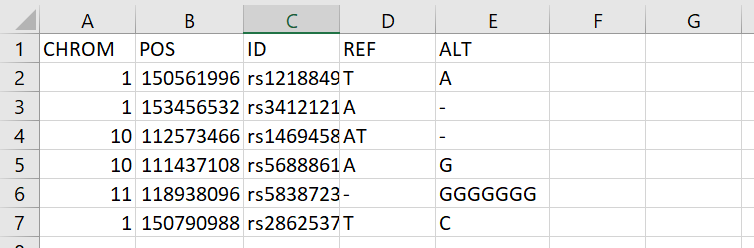
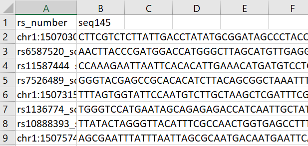
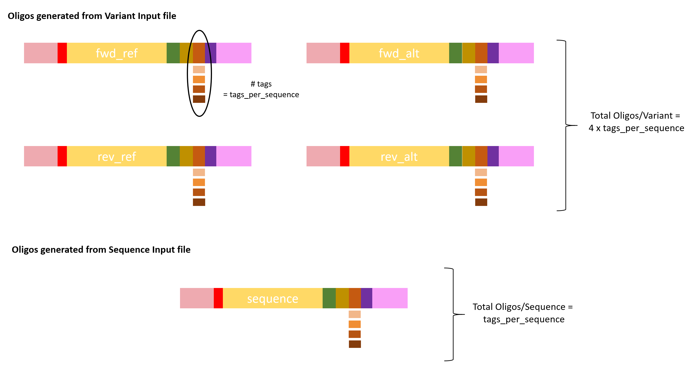

# MPRADesignGenerator


## Installation ##

Use devtools to install MPRADesignGenerator. If you do not have devtools installed, use the following:
```
install.packages("devtools")
```
Then install and load the package:
```
devtools::install_github("goldenac/MPRADesignGenerator")
library("MPRADesignTools")
```
MPRADesignGenerator relies on the **Biostrings** and **BSgenome.Hsapiens.UCSC.hg38** packages from Bioconductor. Install these packages using the following commands.
```
BiocManager::install("Biostrings")
BiocManager::install("BSgenome.Hsapiens.UCSC.hg38")

library("Biostrings")
library("BSgenome.Hsapiens.UCSC.hg38")
```

## Generating Your File ##

The .csv file containing the library of oligos is generated with the generate() function. After installing the package, simply execute the generate function. For example:
```
generate(fwdprimer="GCTAATAAGCTTCACGT",
         revprimer="GTTTAATCCGTACGCTCT",
         tags_per_variant=25,
         enz1="GGTACC",
         enz1FIX="GGATCC",
         enz2="TCTAGA",
         enz2FIX="TCATGA",
         enz3="GGCC.....GGCC",
         enz3FIX="GCGC.....GGCC",
         variant_input_path="Documents/input_files/variant_input.csv",
         tag_path="Documents/input_files/tags.csv",
         sequence_path="Documents/input_files/scrambled_sequences.csv"
)
```

### Arguments to the *generate()* function ###

Argument | Explanation | Example
---- | ---- | ----
fwdprimer | Forward primer entered as a string | "ACTG"
revprimer | Reverse primer entered as a string | "GATC" 
tags_per_variant | Integer indicating the number of tags used for each variant class (fwd_ref, fwd_alt, rev_ref, rev_alt). The total number of oligonucleotides generated for each variant is equal to 4 x tags_per_variant | 25
enz1 | Restriction enzyme entered as a string | "GGTACC"
enz1FIX | Modified digestion site for enzyme1 (How the sequence should be changed if a digestion site is found in the DNA sequence) entered as a string. | "GGATCC"
enz2 | restriction enzyme entered as a string | "TCTAGA"
enz2FIX | Modified digestion site for enzyme2 (How the sequence should be changed if a digestion site is found in the DNA sequence) entered as a string.| "TCATGA"
enz3 | Restriction enzyme entered as a string. **NOTE:** Use a period as shown in the example to indicate any base. | "GGCC.....GGCC"
enz3FIX | Modified digestion site for enzyme3 (How the sequence should be changed if a digestion site is found in the DNA sequence) entered as a string. | "GCGC.....GGCC"
variant_input_path | Path to file containing variant coordinates and ref/alt alleles entered as a string. | "Documents/input_files/variant_input.csv"
tag_path | Path to file containing tag sequences entered as a string. | "Documents/input_files/tags.csv"
scrambled_path | Path to file containing scrambled sequences entered as a string. This argument is optional. | "Documents/input_files/scrambled_sequences.csv"

### Input File Format ###

MPRADesignGenerator makes use of three user-provided .csv files (two required, one optional). **NOTE:** column headings cannot be changed.

- *File 1: Variant Input* - Provides the coordinates (hg38), rsID, and ref/alt alleles for each variant
    
 
   
- *File 2: Tags* - Provides all tag sequences
    

    
- *File 3: Scrambled Sequences* - Provides an ID and 145bp "scrambled" sequence. Note that these sequences do not necessarily have to be scrambled; any 145bp sequence can be provided.
    



### Output File ###

The *generate()* function writes a file named "OLIGO_LIBRARY.csv"  to the current working directory. This file is the final oligonucleotide library. It contains all oligos generated for variants from the Variant Input file and sequences provided in the Sequence Input file.

General Oligo Format:




## About MPRADesignGenerator ##

### Purpose ###

This application is inspired by Dr. Andrew Ghazi's [*mpradesigntools*](https://github.com/andrewGhazi/mpradesigntools). Like *mpradesigntools*, it's purpose is to quickly and correctly generate a design file for an MPRA experiment. It is, however, unique in its user-directed approach to modifying restriction sites which appear in the genomic context of oligonucleotides. It is also unqiue in its inclusion of oligos generated from sequences provided directly by the user in addition to oligos whose sequences have been generated from coordinates provided by the user.

> Andrew R Ghazi, Edward S Chen, David M Henke, Namrata Madan, Leonard C Edelstein, Chad A Shaw; Design tools for MPRA experiments, Bioinformatics, Volume 34, Issue 15, 1 August 2018, Pages 2682–2683, https://doi.org/10.1093/bioinformatics/bty150

### How it Works ###
1. Create oligos from sequences
2. Get genomic sequences for variants
  * From coordinate get 72 bases upstream and 72 bases downstream (72 + 1 + 72 = 145bp). This is the REF sequence.
  * Check sequences for restriction sites
      - if restriction site(s) **is not** overlapping snp (base 73), change it to the "fix" specified by the user
      - if restriction site(s) **is** overlapping snp (base 73), drop the variant from the library
  * Create the ALT sequence as specified in Variant Input file
      - **SNPs**: base 73 is swapped for base in ALT column
      - **Insertions**: bases in ALT column are inserted after base 73. Two bases (one from front, one from end) are removed from the sequence until the length is 145 or 144bp. The same bases are then removed from the REF sequence.
      - **Deletions**: the number of bases in the REF column are counted. The same number of bases are removed starting with base 73 and moving to the right to create the ALT sequence. The bases that will be deleted by the program are compared to the bases listed in the REF column; if they do not match, the program will still create the ALT sequence but will give a warning.
  * Create reverse complementary (REV) sequences for both REF and ALT sequences
3. Create oligos for each sequence (REF_FWD, REF_REV, ALT_FWD, ALT_REV) created from Variant Input file
4. Combine oligos from sequences and oligos from variant input into the final Oligo Library
