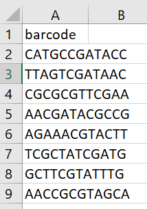

# MPRADesignGenerator


## Installation ##

Use devtools to install MPRADesignGenerator. If you do not have devtools installed, use the following:
```
install.packages("devtools")
```
Then install and load the package:
```
devtools::install_github("goldenac/MPRADesignGenerator")
library("MPRADesignTools")
```
MPRADesignGenerator relies on the **Biostrings** and **BSgenome.Hsapiens.UCSC.hg38** packages from Bioconductor. Install these packages using the following commands.
```
BiocManager::install("Biostrings")
BiocManager::install("BSgenome.Hsapiens.UCSC.hg38")

library("Biostrings")
library("BSgenome.Hsapiens.UCSC.hg38")
```

## Generating Your File ##

The .csv file containing the library of oligos is generated with the generate() function. After installing the package, simply execute the generate function. For example:
```
generate(fwdprimer="GCTAATAAGCTTCACGT",
         revprimer="GTTTAATCCGTACGCTCT",
         tags_per_variant=25,
         enz1="GGTACC",
         enz1FIX="GGATCC",
         enz2="TCTAGA",
         enz2FIX="TCATGA",
         enz3="GGCC.....GGCC",
         enz3FIX="GCGC.....GGCC",
         variant_input_path="Documents/input_files/variant_input.csv",
         tag_path="Documents/input_files/tags.csv",
         discrete_path="Documents/input_files/scrambled_sequences.csv"
)
```

**Arguments to the *generate()* function**

Argument | Explanation | Example
---- | ---- | ----
fwdprimer | Forward primer entered as a string | "ACTG"
revprimer | Reverse primer entered as a string | "GATC" 
tags_per_variant | Integer indicating the number of tags used for each variant class (fwd_ref, fwd_alt, rev_ref, rev_alt). The total number of oligonucleotides generated for each variant is equal to 4 x tags_per_variant | 25
enz1 | Restriction enzyme entered as a string | "GGTACC"
enz1FIX | Modified digestion site for enzyme1 (How the sequence should be changed if a digestion site is found in the DNA sequence) entered as a string. | "GGATCC"
enz2 | restriction enzyme entered as a string | "TCTAGA"
enz2FIX | Modified digestion site for enzyme2 (How the sequence should be changed if a digestion site is found in the DNA sequence) entered as a string.| "TCATGA"
enz3 | Restriction enzyme entered as a string. **NOTE:** Use a period as shown in the example to indicate any base. | "GGCC.....GGCC"
enz3FIX | Modified digestion site for enzyme3 (How the sequence should be changed if a digestion site is found in the DNA sequence) entered as a string. | "GCGC.....GGCC"
variant_input_path | Path to file containing variant coordinates and ref/alt alleles entered as a string. | "Documents/input_files/variant_input.csv"
tag_path | Path to file containing tag sequences entered as a string. | "Documents/input_files/tags.csv"
scrambled_path | Path to file containing scrambled sequences entered as a string. This argument is optional. | "Documents/input_files/scrambled_sequences.csv"

**Input File Format**

MPRADesignGenerator makes use of three user-provided .csv files (two required, one optional). **NOTE:** column headings cannot be changed.

- *File 1: Variant Input* - Provides the coordinates (hg38), rsID, and ref/alt alleles for each variant
    
 
   
- *File 2: Tags* - Provides all tag sequences
    

    
*File 3: Scrambled Sequences* - Provides an ID and 145bp "scrambled" sequence. Note that these sequences do not necessarily have to be scrambled; any 145bp sequence can be provided.
    


### Output File ###


## About MPRADesignGenerator ##

- Purpose
- How it works
    * How are alt sequences created for each variant type
    * How are restriction enzyme sites handled


## Troubleshooting ##

- Problems loading packages
- File does not exist
